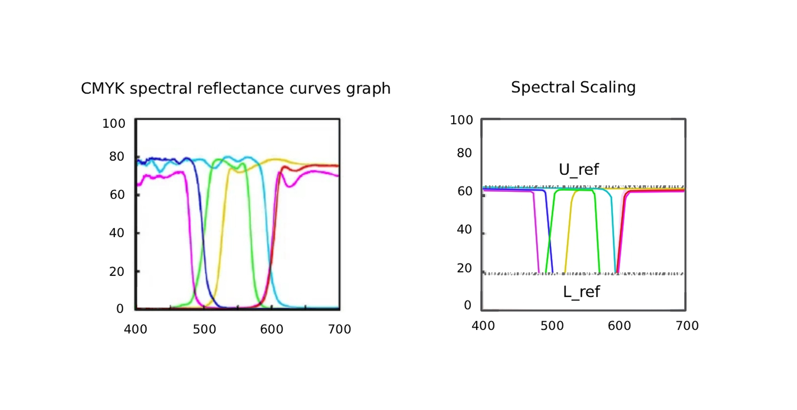

# Spectral Color Model | RGB Data Matrices

This series of matrices demonstrates the encoding of independent data streams into the RGB color space. 
Each matrix is architected for physical reconstruction through spectral pigment normalization.

### Technical Specifications:
* **Encoding:** 24-bit Spatial Matrix
* **Data Channels:** Discrete R, G, B plane isolation
* **Purpose:** High-density physical steganography and Art-Science synthesis

# Spectral Color Model | Full Archive

### 1. RGB Data Matrices

  
  
  
  
  
  
  
  

### 2. Model Synthesis & Visualization

  
  
  

### 3. Documentation (PDF)
* [📄 Spectral Analysis Document 1](Spectral_Analysis_01.pdf)
* [📄 Technical Specifications](Technical_Specs.pdf)
